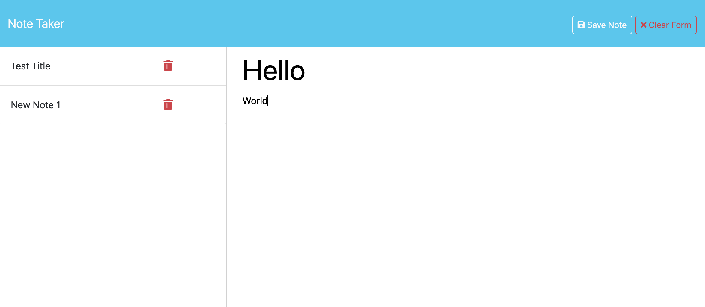

# Note Taker
This is a simple application that allows the user to keep track of notes of things to do.

## Installation

Requires Node.JS and Express

## Usage
Enter the note title and note text when prompted. The application saves the user input to the left column on the page. 

## Contributing
Project for Vanderbilt Full Stack Coding Bootcamp

## License

[MIT](https://choosealicense.com/licenses/mit/)
